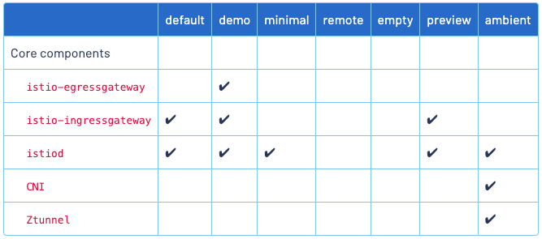
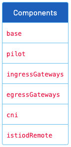

# Istio installation, upgrade and configuration

## IstioOperator API

Ref: <https://istio.io/latest/docs/reference/config/istio.operator.v1alpha1/>

```yaml
apiVersion: install.istio.io/v1alpha1
kind: IstioOperator
spec:
  profile: default
```

## Istio configuration profiles

Ref: <https://istio.io/latest/docs/setup/additional-setup/config-profiles/>

```shell
istioctl profile list
```



## Istio installation

Ref: <https://istio.io/latest/docs/setup/install/>

1. Usting Istio CLI (istioctl)
2. Using Helm Charts
3. Using Istio Operator (discouraged)

### Install with Istioctl

Ref: <https://istio.io/latest/docs/setup/install/istioctl/>

Install the default Istio configuration profile:

```shell
istioctl install
```

Custom Istio installation:

```yaml
istioctl install -f -
apiVersion: install.istio.io/v1alpha1
# Reference: https://istio.io/latest/docs/reference/config/istio.operator.v1alpha1/
kind: IstioOperator 
spec:
  # Configuration profile used as base for installation
  # Other settings you can configure on this level:
  # namespace, hub, revision, tag
  profile: demo

  # Mesh configuration settings: https://istio.io/latest/docs/reference/config/istio.mesh.v1alpha1/
  meshConfig: 
    accessLogFile: /dev/stdout

  # Individual components you can configure: https://istio.io/latest/docs/reference/config/istio.operator.v1alpha1/#IstioComponentSetSpec
  # Includes base, pilot, cni, ztunnel, ingressGatways, egressGatways, istiodRemote
  components:
    # pilot: ..
    # cni: ...
    egressGateways:
    # There can be more than 1 egress gateway - note that to customize a gateway
    # that already exists in the profile (e.g. demo in this case), you need to use the default names
      - name: istio-egressgateway
        enabled: false
    ingressGateways:
        # Disable the default ingress gateway
      - name: istio-ingressgateway
        enabled: false
        # Enable a new ingress gateway
      - name: demo-ingressgateway
        enabled: true
        namespace: custom-ns-name
        label:
          app: custom-label
        # Customize the k8s resources: https://istio.io/latest/docs/reference/config/istio.operator.v1alpha1/#KubernetesResourcesSpec
        k8s:
          resources:
            requests:
              cpu: 5m
              memory: 20Mi
```

#### Install different profiles

Display the names of Istio configuration profiles:

```shell
istioctl profile list
```

Install the `demo` profile:

```shell
istioctl install --set profile=demo
```

#### Display the configuration of a profile

View the setting for the demo profile:

```shell
istioctl profile dump demo
```

View a subset of the entire configuration:

```shell
istioctl profile dump --config-path components.pilot demo
```

#### Show differences in profiles

```shell
istioctl profile diff default demo
```

#### Generate a manifest before installation

```shell
istioctl manifest generate > $HOME/generated-manifest.yaml
```

#### Verify a successful installation

```shell
istioctl verify-install -f $HOME/generated-manifest.yaml
```

### Install with Helm

Ref: <https://istio.io/latest/docs/setup/install/helm/>

#### Prerequisites

```shell
helm repo add istio https://istio-release.storage.googleapis.com/charts
helm repo update
```

#### Installation steps

1. Install the Istio base chart (CRDs):

```shell
helm install istio-base istio/base -n istio-system --set defaultRevision=default --create-namespace
```

2. Install the Istio discovery chart (`istiod`):

```shell
helm install istiod istio/istiod -n istio-system --wait
```

3. (Optional) Install an ingress gateway:

```shell
kubectl create namespace istio-ingress
helm install istio-ingress istio/gateway -n istio-ingress --wait
```

### Istio Operator install

Ref: <https://istio.io/latest/docs/setup/install/operator/>

To install the Istio `demo` configuration profile using the operator:

```shell
kubectl apply -f - <<EOF
apiVersion: install.istio.io/v1alpha1
kind: IstioOperator
metadata:
  namespace: istio-system
  name: example-istiocontrolplane
spec:
  profile: demo
EOF
```

To install `istiod` (control plane) in a different namespace than `istio-system`, specify the namespace using the `values.global.istioNamespace`:

```yaml
apiVersion: install.istio.io/v1alpha1
kind: IstioOperator
...
spec:
  profile: demo
  values:
    global:
      istioNamespace: istio-namespace1
```

### Installing Gateways

Ref: <https://istio.io/latest/docs/setup/additional-setup/gateway/>

Envoy proxies running at the edge of the mesh, providing fine-grained control over traffic entering and leaving the mesh.

```yaml
apiVersion: install.istio.io/v1alpha1
kind: IstioOperator
metadata:
  name: ingress
spec:
  profile: empty # Do not install CRDs or the control plane
  components:
    ingressGateways:
    - name: istio-ingressgateway
      namespace: istio-ingress
      enabled: true
      label:
        # Set a unique label for the gateway. This is required to ensure Gateways
        # can select this workload
        istio: ingressgateway
  values:
    gateways:
      istio-ingressgateway:
        # Enable gateway injection
        injectionTemplate: gateway
```

Then install using standard istioctl commands:

```shell
kubectl create namespace istio-ingress
istioctl install -f ingress.yaml
```

### Customizing the installation configuration

Ref: <https://istio.io/latest/docs/setup/additional-setup/customize-installation/>


