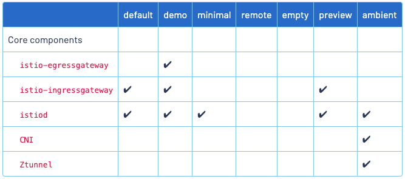
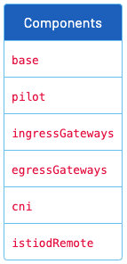

# Istio installation, upgrade and configuration

## IstioOperator API

Ref: <https://istio.io/latest/docs/reference/config/istio.operator.v1alpha1/>

```yaml
apiVersion: install.istio.io/v1alpha1
kind: IstioOperator
spec:
  profile: default
```

## Istio configuration profiles

Ref: <https://istio.io/latest/docs/setup/additional-setup/config-profiles/>

```shell
istioctl profile list
```



## Istio installation

Ref: <https://istio.io/latest/docs/setup/install/>

1. Usting Istio CLI (istioctl)
2. Using Helm Charts
3. Using Istio Operator (discouraged)

### Install with Istioctl

Ref: <https://istio.io/latest/docs/setup/install/istioctl/>

The simplest option is to install the default Istio configuration profile using the following command:

```shell
istioctl install
```

```yaml
istioctl install -f -
apiVersion: install.istio.io/v1alpha1
kind: IstioOperator
spec:
  profile: demo
  components:
    egressGateways:
      - name: istio-egressgateway
        enabled: false
    ingressGateways:
      - name: istio-ingressgateway
        enabled: false
      - name: demo-ingressgateway
        enabled: true
  meshConfig:
    accessLogFile: /dev/stdout
```

This command installs the default profile on the cluster defined by your Kubernetes configuration.

#### Install different profiles

You can display the names of Istio configuration profiles that are accessible to istioctl by using this command:

```shell
istioctl profile list
```

For example, the following command can be used to install the `demo` profile:

```shell
istioctl install --set profile=demo
```

#### Display the configuration of a profile

For example, to view the setting for the demo profile run the following command:

```shell
istioctl profile dump demo
```

To view a subset of the entire configuration, you can use the `--config-path` flag, which selects only the portion of the configuration under the given path:

```shell
istioctl profile dump --config-path components.pilot demo
```

#### Show differences in profiles

```shell
istioctl profile diff default demo
```

#### Generate a manifest before installation

```shell
istioctl manifest generate > $HOME/generated-manifest.yaml
```

The output from `manifest generate` can also be used to install Istio using `kubectl apply`. However, such an alternative installation method may not apply the resources with the same sequencing of dependencies as `istioctl install` and are not tested in an Istio release.

> **:warning:** If attempting to install and manage Istio using `istioctl manifest generate`, please note the following caveats:
>
> 1. The Istio namespace (`istio-system` by default) must be created manually.
> 2. Istio validation will not be enabled by default. Unlike `istioctl install`, the `manifest generate` command will not create the `istiod-default-validator` validating webhook configuration unless values.defaultRevision is set:
>
> ```istioctl manifest generate --set values defaultRevision=default```
>
> 3. `kubectl apply` of the generated manifest may show transient errors due to resources not being available in the cluster in the correct order.
> 4. `istioctl install` automatically prunes any resources that should be removed when the configuration changes (e.g. if you remove a gateway). This does not happen when you use `istio manifest generate` with `kubectl` and these resources must be removed manually.

#### Verify a successful installation

```shell
istioctl verify-install -f $HOME/generated-manifest.yaml
```

### Install with Helm

Ref: <https://istio.io/latest/docs/setup/install/helm/>

#### Prerequisites

```shell
helm repo add istio https://istio-release.storage.googleapis.com/charts
helm repo update
```

#### Installation steps

```shell
helm install <release> <chart> --namespace <namespace> --create-namespace [--set <other_parameters>]
```

The variables specified in the command are as follows:

- `<chart>` A path to a packaged chart, a path to an unpacked chart directory or a URL.
- `<release>` A name to identify and manage the Helm chart once installed.
- `<namespace>` The namespace in which the chart is to be installed.

1. Install the Istio base chart (<https://artifacthub.io/packages/helm/istio-official/base>) which contains cluster-wide Custom Resource Definitions (CRDs) which must be installed prior to the deployment of the Istio control plane:

```shell
helm install istio-base istio/base -n istio-system --set defaultRevision=default --create-namespace
```

2. Install the Istio discovery chart which deploys the `istiod` service (<https://artifacthub.io/packages/helm/istio-official/istiod>):

```shell
helm install istiod istio/istiod -n istio-system --wait
```

3. (Optional) Install an ingress gateway (<https://artifacthub.io/packages/helm/istio-official/gateway>):

```shell
kubectl create namespace istio-ingress
helm install istio-ingress istio/gateway -n istio-ingress --wait
```

> :warning: The namespace the gateway is deployed in must not have a `istio-injection=disabled` label. See [Controlling the injection policy](https://istio.io/latest/docs/setup/additional-setup/sidecar-injection/#controlling-the-injection-policy) for more info.

#### Updating your Istio configuration

You can provide override settings specific to any Istio Helm chart used above and follow the Helm upgrade workflow to customize your Istio mesh installation. The available configurable options can be found by using `helm show values istio/<chart>`; for example `helm show values istio/gateway`.

### Istio Operator Install

Ref: <https://istio.io/latest/docs/setup/install/operator/>

> :warning: Use of the operator for new Istio installations is discouraged in favor of the `Istioctl` and `Helm` installation methods. While the operator will continue to be supported, new feature requests will not be prioritized. The same `IstioOperator` API is used to install Istio with the operator as when using the istioctl install instructions. In both cases, configuration is validated against a schema and the same correctness checks are performed.

### Customizing the installation configuration

Ref: <https://istio.io/latest/docs/setup/additional-setup/customize-installation/>


