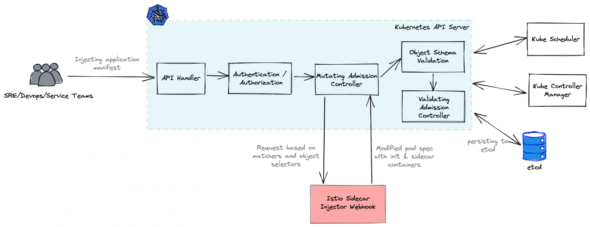
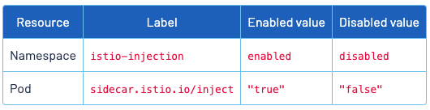
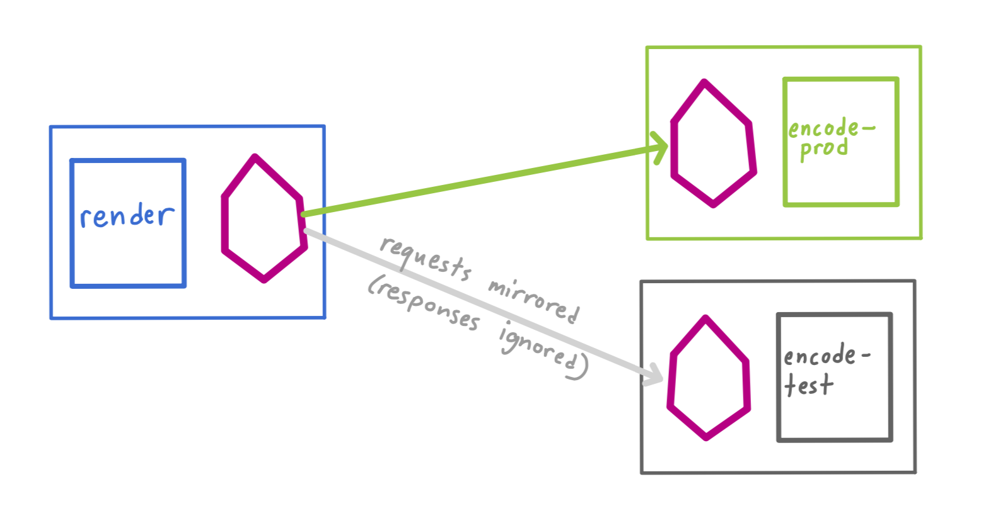

# Istio traffic management

## Istio Gateway vs. Kubernetes Gateway API

- Istio Gateway: <https://istio.io/latest/docs/reference/config/networking/gateway/>
- Kubernetes Gateway API: <https://istio.io/latest/docs/tasks/traffic-management/ingress/gateway-api/>

## Sidecar resource



Ref: <https://istio.io/latest/docs/reference/config/networking/sidecar/>

Sidecar configuration in the root namespace called `istio-config`, that configures sidecars in all namespaces to allow egress traffic only to other workloads in the same namespace as well as to services in the `istio-system` namespace:

```yaml
apiVersion: networking.istio.io/v1alpha3
kind: Sidecar
metadata:
  name: default
  namespace: istio-config
spec:
  egress:
  - hosts:
    - "./*"
    - "istio-system/*"
```

## Sidecar injection

Ref: <https://istio.io/latest/docs/setup/additional-setup/sidecar-injection/>

### Automatic sidecar injection

Set the following label on a namespace:

```shell
istio-injection=enabled
```

### Controlling the injection policy

Injection can also be controlled on a per-pod basis, by configuring the `sidecar.istio.io/inject` label:



### Manual sidecar injection

To manually inject a Deployment, use `istioctl kube-inject`.

## Gateway resource

The Gateway resource is used to define the host and port combination for the Ingress Gateway pod.

Ref: <https://istio.io/latest/docs/reference/config/networking/gateway/>

### Ingress Gateways

Ref: <https://istio.io/latest/docs/tasks/traffic-management/ingress/ingress-control/>

### Egress Gateways

Ref: <https://istio.io/latest/docs/tasks/traffic-management/egress/egress-gateway/>

## VirtualService resource

The VirtualService resource defines the traffic rules. A Gateway can be attached to a VirtualService to expose an internal Kubernetes service through the ingress gateway.

Ref: <https://istio.io/latest/docs/reference/config/networking/virtual-service/>

You can use match conditions, manipulate headers, configure CORS policy, set timeouts and retries, inject failures, rewrite hosts, and more in the VirtualService resource.

## DestinationRule resource

The rules from the DestinationRule resource are applied once the traffic has been routed to the destination and can be used to configure traffic policies, such as load balancer policies and circuit breakers.

Ref: <https://istio.io/latest/docs/reference/config/networking/destination-rule/>

To define different service versions, you can use subsets in the DestinationRule; once defined, you can use the subsets in VirtualService to route the traffic to a specific service version. Labels are used to create the subsets.

## ServiceEntry resource

ServiceEntry resource is used to make an external service or API part of the mesh; they are commonly used to bring VM workloads to the mesh or when configuring global hostnames to route the traffic across multiple clusters.

Ref: <https://istio.io/latest/docs/reference/config/networking/service-entry/>

## Traffic Mirroring

With traffic mirroring, you can duplicate a request and send it to a different endpoint, without affecting the original request.

```yaml
kubectl apply -f - <<EOF
apiVersion: networking.istio.io/v1alpha3
kind: VirtualService
metadata:
  name: httpbin
spec:
  hosts:
    - httpbin
  http:
  - route:
    - destination:
        host: httpbin
        subset: v1
      weight: 100
    mirror:
      host: httpbin
      subset: v2
    mirrorPercentage:
      value: 100.0
EOF
```


